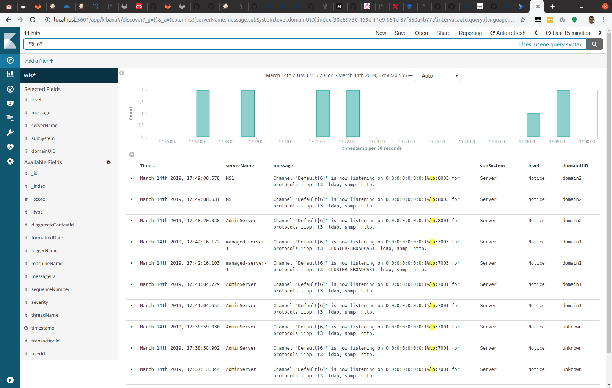

# WebLogic Logging Exporter

The goal of this project is to provide an easy to configure, robust, and production-ready solution to access
WLS log information through Elasticsearch and Kibana.

The WebLogic Logging Exporter adds a log event handler to WebLogic Server,
such that WebLogic Server logs can be integrated into [Elastic Stack](https://www.elastic.co/products)
in Kubernetes directly,  by using the [Elasticsearch](https://www.elastic.co/products/elasticsearch) REST API.

The current version of the WebLogic Logging Exporter is 1.0.1, which was released on Wednesday, January 27, 2021.
This version supports pushing logs into Elasticsearch using the REST API.

The following features are planned for the next few releases:

* Push logs into a fleuntd aggregator using the REST API.
* Write logs in JSON format into the file system so that they could be collected and published by a
  sidecar, e.g. fluentd or Logstash.
* Provide the ability to publish other logs (i.e. other than the server logs).

## Contents

* How to [download the release](#download-the-release)
* How to [build from source](#building-from-source)
* How to [install](#installation) the WebLogic Logging exporter
* How to [run Elasticsearch and Kibana locally for testing](#running-elasticsearch-and-kibana-locally-for-testing)
* How to [contribute](#contributing) to this project
* [License](#license) information


## Download the release

You can download the WebLogic Logging Exporter already compiled for you from the
[releases page](https://github.com/oracle/weblogic-logging-exporter/releases).

## Building from source

If you prefer, you can build the WebLogic Logging Exporter from the source code.  To do this, you will
need access to some WebLogic Server libraries.  There are two ways to get these libraries:

* Populate your local Maven repository with the required files from a local WebLogic Server installation
  using the Oracle Maven Synchronization plugin, or
* Use the Oracle Maven repository to download them as part of your build; this requires registration and
  configuring your local Maven installation with the appropriate authentication details.

### Populating your local Maven repository from a local WebLogic Server installation

You can use the Oracle Maven Synchronization plugin, which is included in your WebLogic Server installation,
to install the necessary dependencies into your local Maven repository.

There are two steps:

* Install the Oracle Maven Synchronization plugin.
* Run the `push` goal to populate your local Maven repository from your WebLogic Server installation.

#### Installing the Oracle Maven Synchronization plugin

To install the plugin, navigate to your WebLogic Server installation, then enter the commands (this example
assumes you installed WebLogic Server in `/u01/wlshome`):

```
cd /u01/wlshome/oracle_common/plugins/maven/com/oracle/oracle-maven-sync/12.2.1
mvn install:install-file -DpomFile=oracle-maven-sync-12.2.1.pom -Dfile=oracle-maven-sync-12.2.1.jar
```

#### Popoulating your local Maven repository

To populate your local Maven repository from your WebLogic Server installation, enter this command:

```
mvn com.oracle.maven:oracle-maven-sync:push -DoracleHome=/u01/wlshome
```

You can verify the dependencies were installed by looking in your local Maven repository which is
normally located at `~/.m2/repository/com/oracle/weblogic`.


### Using the Oracle Maven repository

**Note**: If you populated your local repository using the Oracle Maven Synchronization plugin, then this
step is *not* required.

To access the Oracle Maven repository, refer to the documentation
[available here](https://docs.oracle.com/middleware/1213/core/MAVEN/config_maven_repo.htm#MAVEN9010).


### Building the WebLogic Logging Exporter

To build the WebLogic Logging Exporter, clone the project from GitHub and then build it with Maven:

```
git clone git@orahub.oraclecorp.com:oracle/wls-logging-exporter.git
mvn install
```

The `weblogic-logging-exporter.jar` will be available under the `target` directory.

## Installation

This section outlines the steps that are required to add the WebLogic Logging Exporter to WebLogic Server.

1. Download or build the WebLogic Logging Exporter as described above.

1. Copy the `weblogic-logging-exporter.jar` into a suitable location, e.g. into your domain directory.

1. Add a startup class to your domain configuration.

   * In the Administration Console, navigate to "Environment" then "Startup and Shutdown classes" in the main menu.
   * Add a new Startup class. You may choose any descriptive name and the class name must be
     `weblogic.logging.exporter.Startup`.
   * Target the startup class to each server that you want to export logs from.

   You can verify this by checking for the update in your `config.xml` which should be similar to this example:

    ```
    <startup-class>
        <name>LoggingExporterStartupClass</name>
        <target>AdminServer</target>
        <class-name>weblogic.logging.exporter.Startup</class-name>
    </startup-class>
    ```

1. Add `weblogic-logging-exporter.jar` and `snakeyaml-1.27.jar` to your classpath.

   This project requires `snakeyaml` to parse the YAML configuration file.  If you built the project locally,
   you can find this JAR file in your local maven repository at `~/.m2/repository/org/yaml/snakeyaml/1.27/snakeyaml-1.27.jar`.
   Otherwise, you can download it from [Maven Central](https://search.maven.org/artifact/org.yaml/snakeyaml/1.27/bundle).

   Place the file(s) in a suitable location, e.g. your domain directory.

   Update the server classpath to include these file(s).  This can be done by adding a statement to the end of your
   `setDomainEnv.sh` script in your domain's `bin` directory as follows (this example assumes your domain
   directory is `/u01/base_domain`):

   ```
   export CLASSPATH="/u01/base_domain/weblogic-logging-exporter.jar:/u01/base_domain/snakeyaml-1.27.jar:$CLASSPATH"
   ```

1. Create a configuration file for the WebLogic Logging Exporter.

   There are two options currently - the version 1.x configuration, or the new version 2.x configuration - please
   note that the 2.x configuration is `alpha` and therefore subject to change as we get close to the 2.0 release.

   a. Version 1.x configuration

       Create a file named `WebLogicLoggingExporter.yaml` in your domain's `config` directory.  You can copy the
       [sample provided in this project](samples/WebLogicLoggingExporter.yaml) as a starting point.  That sample
       contains details of all of the available configuration options.  A completed configuration file might look
       like this:

       ```
       publishHost:  localhost
       publishPort:  9200
       domainUID:  domain1
       weblogicLoggingExporterEnabled: true
       weblogicLoggingIndexName:  domain1-wls
       weblogicLoggingExporterSeverity:  Notice
       weblogicLoggingExporterBulkSize: 1
       weblogicLoggingExporterFilters:
       - filterExpression:  'severity > Warning'
       ```

       Note that you must give a unique `domainUID` to each domain.  This value is used to filter logs by domain when you
       send the logs from multiple domains to the same Elasticsearch server.  If you are using the WebLogic Kubernetes
       Operator, it is strongly recommended that you use the same `domainUID` value that you use for the domain.

       It is also strongly recommended that you consider using a different Elastcsearch index name for each domain.

   b. Version 2.x configuration

       If you prefer to place the configuration file in a different location, you can set the environment variable
       `WEBLOGIC_LOGGING_EXPORTER_CONFIG_FILE` to point to the location of the file.

       If you want to write the JSON logs to a file instead of sending it elasticsearch directly use the following configuration
       [file](samples/WebLogicFileLoggingExporter.yaml) and adjust it to your needs. Make sure to rename it to WebLogicLoggingExporter.yaml.

6. Restart the servers to activate the changes.  After restarting the servers, they will load the WebLogic
   Logging Exporter and start sending their logs to the specified Elasticsearch instance.  You can then
   access them in Kibana as shown in the example below. You will need to create an index first and then go to
   the visualization page.




You can also use a curl command similar to the following example to verify that logs have been posted to Elasticsearch.
The default index name is `wls`, and `docs.count` should be greater than zero indicating that log entries
are being sent to Elasticsearch.

```
$ curl "localhost:9200/_cat/indices?v"
health status index               uuid pri rep docs.count docs.deleted store.size pri.store.size
yellow open   wls                 q4Q2v2dXTBOyYsHZMdDe3H 5   1         23            0      101kb          101kb
```

## Running Elasticsearch and Kibana locally for testing

If you wish to test on your local machine, a [sample](samples/run-elk-local.sh) is provided to run Elasticsearch
and Kibana in Docker on your local machine.

## Contributing

Please read [CONTRIBUTING.md](CONTRIBUTING.md) for details on our code of conduct, and the process for submitting pull requests to us.


## License

This project is licensed under the [_Universal Permissive License, Version 1.0_](http://oss.oracle.com/licenses/upl)
